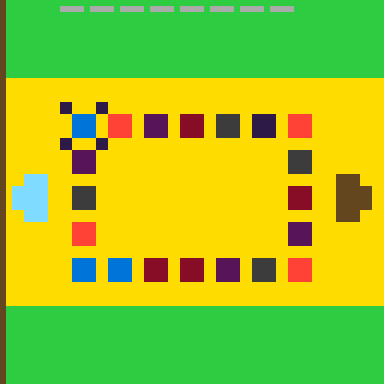
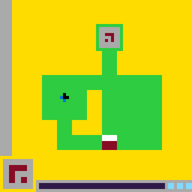
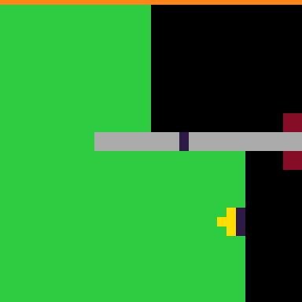

# ARC-AGI-3 Agent

An autonomous game-playing agent for [ARC Prize 2026 – ARC-AGI-3](https://arcprize.org/competitions/2026/arc-agi-3)
by **baderalotaibi11**.

Two tracks, one system:
- **The programmatic agent (v79)** — a pure-Python "small scientist" that
  learns each game live from frame diffs. No LLM, CPU only. Leaderboard
  **0.26–0.27** — a strong, robust floor.
- **The LLM rescue-agent** — v79 drives; when it stalls, a GPU-served
  open-weights model (Qwen2.5) is invoked to break through, and can write
  BFS/search code in a sandbox. The programmatic agent is a hard floor, so
  the LLM can only add value. Being validated on GPU (Colab) before it
  ships to Kaggle.

**Status:** the programmatic track is mature and plateaued at the LB
ceiling; active work is the LLM track (the only route past ~0.3). See
[Current status](#current-status--the-llm-pivot).

## See it play

The champion on three of the public games (local runs, real engine):

| lp85 — 5 levels | ls20 — maze + key | vc33 — click puzzle |
|---|---|---|
|  |  |  |

## The problem

ARC-AGI-3 drops the agent into unseen 64×64 grid games with no rules, no
manual, and no reward signal beyond "levels completed." The agent gets a
frame, picks one of 8 actions (4 arrows-ish keys, 2 auxiliary keys, a
click with x/y, and reset), and gets the next frame. Scoring is per level,
weighted by level index, and multiplied by **(baseline_actions /
actions_taken)²** — so solving levels *fast* matters as much as solving
them at all.

## Current status & the LLM pivot

The leaderboard is measured on **110 private games**; we can only test
against **25 public** ones. That gap drove the whole story:

| Milestone | LB |
|---|---|
| First working world-model agent | 0.00 → 0.17 |
| Mature programmatic agent (v54–v79) | **0.26–0.27** |
| Leaderboard #1 (a GPU LLM-agent) | ~3.57 |

The hard finding: past a point, **local score stopped predicting the LB**
— we were overfitting the 25 public games; their solutions don't
replicate on the private set. Even correct bug fixes and a +50% local
mean moved the LB by ±0.01. The programmatic ceiling is real (~0.27).

The top of the board is entirely **LLM agents** (a large open-weights
model reasoning in Python each turn, served on GPU). So the project
pivoted to that architecture — with a twist: instead of the LLM driving
(slow, risky), **the proven programmatic agent drives and the LLM rescues
stalls**, so it can only add to the 0.27 floor. A key lesson from the
first GPU run: the framework plays 110 games in **concurrent threads**, so
the model must be loaded **once and served** (a per-agent load OOMs the
GPU) — exactly why strong entries use a vLLM server.

**GPU eval loop (`arc_colab_eval.ipynb`)** — because a single Kaggle
submission/day with hidden logs made iteration blind, the repo ships a
Colab notebook that serves the real model on a GPU and measures the LLM
agent vs. the floor on the public games. It self-clones the repo (always
latest) and is regenerated by CI on every commit. Open it directly:
[in Colab](https://colab.research.google.com/github/BDR-Pro/arc-prize-2026-arc-agi-3/blob/main/arc_colab_eval.ipynb).

## Design philosophy (programmatic track)

The programmatic agent is a small scientist, not a policy network:

```
observe → what changed? → form rules → plan → act → verify → update
```

Everything it knows is learned live, in-game, from frame diffs. There is
no pretraining, no game-specific code, and no memorization of the public
games — the evaluation games are private, so only *mechanisms* transfer.

## Architecture (programmatic track)

### 1. State identity: volatility-masked hashing

The raw grid is a terrible state key: score counters, energy bars and
ambient animations change every frame, making every frame look like a new
state and blinding any world model. The agent tracks per-cell change
frequency plus per-row/per-column change rates, and **masks cells that
change in ≥20% of frames (or rows/columns changing in ≥40%)** out of the
state hash. A depleting energy bar — which flips a *different* cell each
action, defeating per-cell statistics — is caught by the row/column rule.
The mask self-heals as evidence accumulates.

### 2. World model: learned transition graph

`TransitionModel` records `(state, action) → next state` counts, no-op
actions, score-raising transitions, and deadly transitions. It powers:

- **No-op skipping** — actions proven useless in a state are never retried.
- **Death avoidance** — transitions that ended the game are banned.
- **BFS planning** — when local exploration is exhausted, the agent plans
  a path through the learned graph to a known score-up transition, or to
  the nearest frontier state with untried actions.
- **Plan verification** — plans are executed step-by-step against
  predicted states and abandoned on the first mismatch.

### 3. Object-centric perception: the avatar model

Between consecutive frames, the agent diffs the grid, restricts attention
to the changed region's bounding box, and matches color masses to detect
**movers**. Each observed move votes `(color, action) → (dx, dy)`. The
avatar is the color whose deltas are most consistent per action, with
several guards learned from painful experience:

- Colors whose dominant delta is identical for ≥3 different actions are
  **autonomous** (gravity, conveyors) — not the avatar.
- Two actions never share a delta in a real control scheme; duplicate
  deltas are dropped (falling pieces made every key "move down").
- Steps of 1–5 cells are accepted (some avatars move 2, 3, even 5 cells
  per press).
- Colors that block movement repeatedly and were never walked on become
  **wall colors**; colors that ever moved under our actions are *pushable
  blocks*, never walls.

Once ≥2 directions are known, **navigation** activates: BFS over the grid
(stepping by the learned deltas, checking every crossed cell against wall
colors) toward goal-colored cells, then rare-colored cells, then
unexplored frontier — and on arrival the agent tries every untried
non-movement action (the "interact" key varies per game).

### 4. Interface learning

Games advertise available actions, but half the battle is learning which
actions *matter*. Per-action global effect/no-op counters demote actions
that are no-ops in ≥95% of tries (ratio-based, because per-action counter
pixels tick on every action and would otherwise register as "effects").
An action that mostly *reverts* the previous transition is treated as an
undo button and demoted.

### 5. Click intelligence

Clicking has a 4096-cell action space, so clicks are prioritized in tiers:

1. Objects whose color matches a **goal color** from an earlier level
2. Exact coordinates that provably changed the grid before
3. Objects whose *color* has a productive click history
4. Cells breaking a near-perfect mirror symmetry (≤8 broken pairs — a
   common "repair the picture" puzzle archetype)
5. Object centroids, enclosed pockets (ring interiors), recently-changed
   cells — shuffled for coverage diversity

Colors clicked ≥8 times without any effect are skipped entirely, and —
crucially — the agent learns **contextual dead-click rules**: "cell (x, y)
showing color c does nothing" (≥4 no-op clicks in that exact appearance).
Keying the rule by appearance means a button that arms itself (and
changes color) escapes the ban, while genuinely dead decor stays banned
across every state of the level. This one rule cut wasted clicks enough
to let deep-level runs finish: level 5 of an 8-level game has been solved
in 56 actions against a 41-action human baseline.

### 6. Memory across resets and levels

`GameMemory` persists for the whole game: the state graph, tried-action
sets, good click targets, wall/goal colors, and — critically — the **best
action prefix per level-start state**, pruned of visible no-ops. After a
death, the agent replays the pruned prefix instead of re-earning progress.
Goal colors (colors that shrank when the score went up) carry across
levels, so later levels start with a target hypothesis. This is how the
agent has solved a level-5 stage at baseline efficiency: everything it
learned in levels 1–4 compressed level 5 to 42 actions.

### 7. Exploration policy (the action loop)

Priority order each frame:

1. Replay a banked winning prefix (after death)
2. Opening probe: press each simple action 3× (converges the avatar model
   in ~12–24 actions)
3. Follow the current verified plan
4. Exploit a known score-up transition
5. Navigate toward goal / rare / frontier cells
6. Momentum: repeat an action while it keeps discovering new states
   (capped, fixation-guarded)
7. Explore an untried, non-no-op, non-deadly action in this state
8. BFS-plan toward score-ups or frontier states
9. Reset if stuck; otherwise a safe fallback action

Determinism: the RNG is seeded from the game id, and periodic "phase
reseeds" escape long no-progress ruts without sacrificing
reproducibility. Anti-fixation logic suppresses any action dominating the
recent window without score progress.

## Architecture (LLM rescue track)

The LLM layer wraps the programmatic agent; every piece is designed so the
programmatic floor is never lost.

- **Inverted control.** v79 chooses every frame. The LLM is queried *only*
  after v79 stalls (no score-up for N actions) — expensive reasoning is
  spent exactly where the rule-based agent fails.
- **Two reply modes.** The model sees the board as objects + an ASCII
  color grid + valid actions + recent history, and replies either with a
  direct action list *or* a fenced `python` block that gets `grid`,
  `objects`, `valid` and builds a `plan` — letting it run BFS/search in a
  restricted sandbox (no imports; malicious code just yields nothing).
- **Shared, served model.** The framework runs 110 games in concurrent
  threads, so the model is a thread-safe singleton loaded once (a
  per-agent load OOMs the GPU → the 0.00 crash we hit and fixed); the
  target design serves it via **vLLM** for fast concurrent generation.
- **Hard floor.** Any model failure, empty/illegal output, unproductive
  stint, per-game call cap, or a global time budget hands control back to
  v79. The LLM can only add to the 0.26 floor.
- **Backends** (`llm/llm_client.py`): `mock` (plumbing tests), `openai`
  (vLLM server), `hf` (transformers). Selected by env var.

## Development methodology

- All 25 public games run **offline** against the real `arc-agi` engine in
  a local harness with the official scoring formula.
- Every change is evaluated on **25 games × 3 RNG seeds** before adoption;
  single runs swing ±3 levels on seed luck alone.
- One change class per version; the champion is only replaced on a
  verified multi-seed win. 30+ versions were evaluated this way.
- Failed ideas are kept in the version log — they're half the knowledge.

## Version history

| Version | Highlights |
|---|---|
| v1–v9 | First world-model versions; scored 0.00 (see v13's bug) |
| v10 | Object-centric navigation added |
| v11 | Volatility-masked state hashing; wall-color learning |
| v12 | Diff-based avatar detection (bbox-restricted mover matching) |
| v13 | **Critical fix**: available_actions int conversion silently failed since v1 (`GameAction(6)` raises; `from_id` is the API) — the agent had been probing phantom actions with ~6/7 of its budget, locally *and* on Kaggle. Also: interface learning, row/column volatility masking |
| v14 | Banked replays pruned of visible no-ops |
| v16 | Opening probe; gated exploration heuristics; 1–3-cell steps |
| v22 | Ratio-based uselessness; duplicate-delta dirmap filter |
| v27 | Pushable blocks are not walls (Sokoban-style games) |
| v31 | Symmetry-repair click prior (capped) |
| v35 | Goal-color click tier (cross-level transfer for clicking) |
| v39 | Faster interface convergence (uselessness threshold 25→15) |
| v42 | Plans/replays/momentum cleared on level transitions (a plan built for level N no longer leaks into level N+1) |
| v45 | Contextual dead-click rules ("this cell in this appearance does nothing") — mean score +68% over v42; the lp85 deep-run now reproduces by mechanism (8.7 game points on one seed) |
| v48 | Click-only games probe deeper per state (cap 96→192) — with dead-context pruning cleaning the lists, the deeper sweep pays: best levels count since the cap-tuning era, same mean |
| v54 | Rerun telemetry: the agent logs compact diagnostics while playing the private evaluation games — every submission doubles as a probe of the hidden set (replays are not exposed for this competition) |
| v58 | Desperation mode: games with zero score after 1,200 actions activate an extended arsenal (react-interact, small-object targeting, overlap arrival, copy-task clicks) that scored games never see — capabilities become risk-free. Plus a wall-clock-capped 8,000-action budget. |
| v59 | Sequence-legend reader (desperation-gated): a horizontal row of small colored squares in the screen margin is read as "visit these colors in this order" and drives navigation |
| v61-v62 | 16,000-action budget, wall-clock capped at 160s/game with a guaranteed 4,000-action floor; BFS planning cost-throttled on big graphs |
| v67 | Audit hardening: per-frame hash/count caching (identical behavior, ~2x fewer full-grid scans -- more actions inside the Kaggle time cap). A 7-angle bug audit also resurrected the long-dead multi-step planner in a parked variant awaiting better plan targets |
| v70 | Evidence-gated collect-solver: archetype execution activates only after the world confirms it |
| **v73** | CROSS-LEVEL TRANSFER: level N's winning sequence replays at level N+1 (full tail, then finishing-move-only as a second stage), last-win clicks become the top click tier -- ar25 completes level 2 at human-baseline pace (52 actions vs 50); campaign-best mean |

Local benchmark trajectory (25 public games, sum of levels over 3 seeds):
v10 ≈ 12 → v13 ≈ 60 → v39 = **61 levels**, with mean per-game score up
~40× since v10. The current frontier is first-solve *speed*: efficiency
is squared in the score, and the deep-level replay machinery already
produces near-baseline solves when early levels go fast.

| **v79** | Programmatic line matured; correctness fixes (color-0 clicks, empty-available guard). LB **0.26** — the programmatic ceiling. Serves as the hard floor under the LLM agent. |
| **LLM rescue-agent** | v79 + GPU-served Qwen2.5; LLM invoked on stalls, can write BFS/search code. First GPU run crashed (0.00) on a per-agent model load across 110 concurrent threads; fixed with a thread-safe shared singleton (0.26, floor restored). Real lift requires a vLLM server — validated on Colab GPU before shipping to Kaggle. |

## Repo layout

- `my_agent.py` — the programmatic agent (v79), also the LLM floor.
- `versions/` — every evaluated version (the failed ideas are half the
  knowledge).
- `llm/` — the LLM rescue-agent: `llm_client.py` (backends), `render.py`
  (board→text), `agent.py` (inverted control + code sandbox).
- `my_agent_llm.py` — the single-file bundle (v79 inlined) the Kaggle
  kernel loads; regenerated by `build_llm_bundle.py`.
- `arc_colab_eval.ipynb` — GPU eval notebook (self-clones the repo).
- `eval_harness.py`, `diag.py`, `optimal_search.py`, `make_gif.py` —
  local tooling. `NOTES.md` — the full campaign log.
- `.github/workflows/update-colab.yml` — regenerates the bundle + Colab
  notebook on every commit.

---

*This README is embedded in the submission notebook and updated with
every agent change.*
